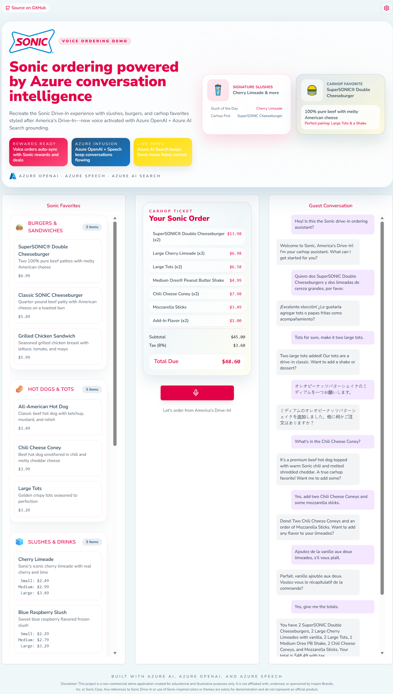
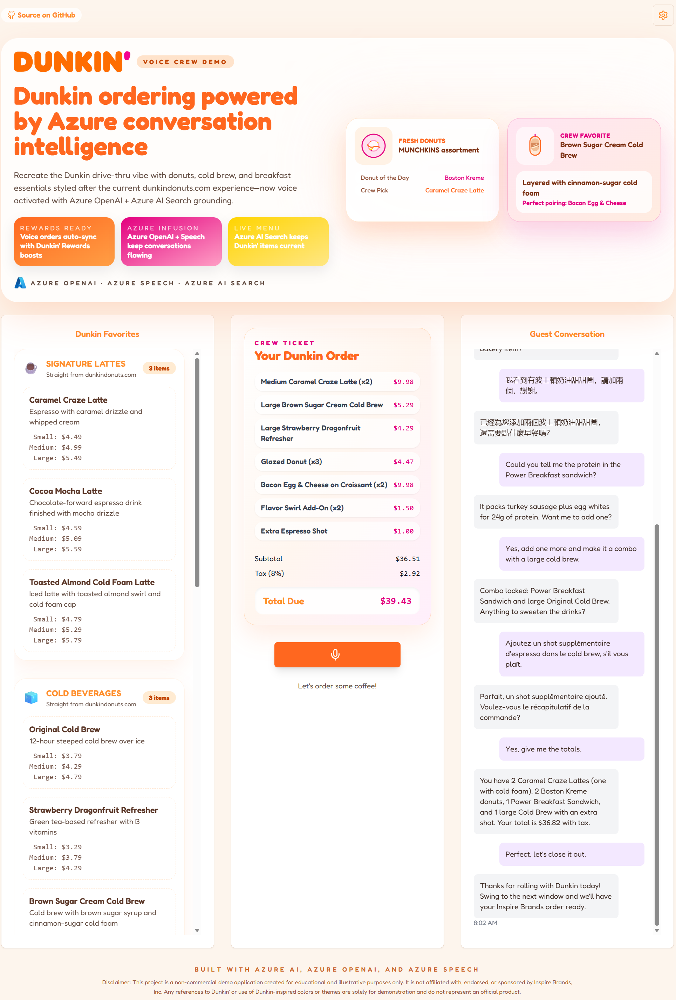
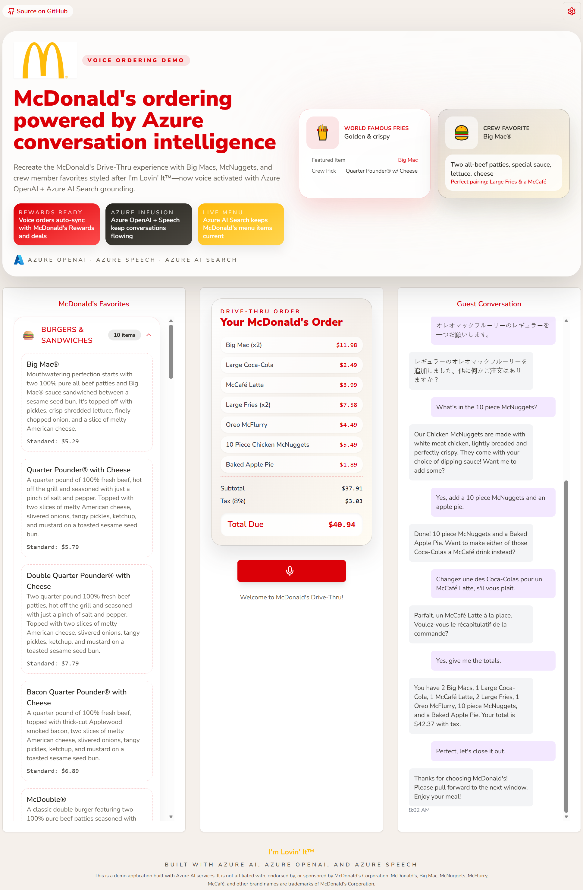
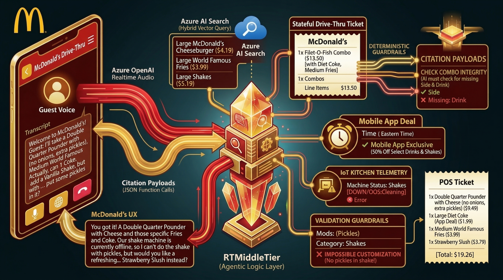
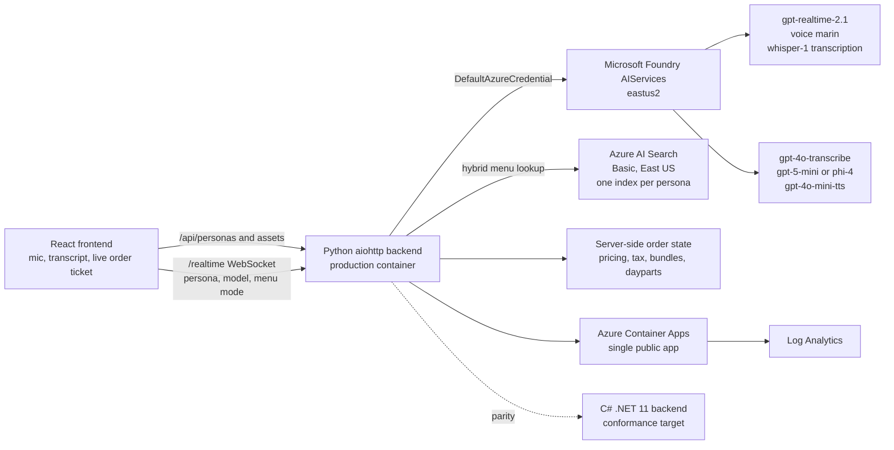

# Azure AI Drive-Thru

Azure AI Drive-Thru is a unified, multi-persona voice ordering demo for drive-thru and counter-service scenarios. One React frontend and one production Python backend serve the Sonic Drive-In, Dunkin', and McDonald's persona packs, with per-persona menus, prompts, themes, pricing rules, dayparts, happy-hour logic, and Azure AI Search indexes. The demo supports both a low-latency realtime voice pipeline and a cascade speech-to-text, reasoning, text-to-speech pipeline on Microsoft Foundry.

> This is a non-commercial demo application created for educational and illustrative purposes only. It is not affiliated with, endorsed by, or sponsored by the referenced brands or trademark owners. Brand references, colors, menu terms, and themes are used solely to demonstrate persona-specific voice ordering patterns and do not represent an official product.

## See it in action

**Microsoft Foundry AI Drive Thru** brings real-time voice ordering to quick serve restaurants. Every brand persona orders from its own Azure AI Search menu, server-side rules handle combos, up-sells, add-ons, and happy-hour pricing, and the voice model comes from the Microsoft Foundry model catalog.

https://github.com/user-attachments/assets/d4dc2713-5117-45cd-ba49-9aa2d707432d

*About 5 minutes, recorded from the running app using its built-in Demo Mode.*

## Screenshots
| Persona | Desktop view |
| --- | --- |
| Sonic Drive-In |  |
| Dunkin' |  |
| McDonald's |  |



The architecture image above came from the standalone McDonald's demo. It is useful for the agentic ordering flow, but the current unified app uses the architecture shown below.

## Current architecture



## Features

- Three persona packs under `personas/`: `sonic`, `dunkin`, and `mcdonalds`. Each pack owns `persona.json`, `menu/menuItems.json`, prompt YAML, hints, assets, and theme data.
- Persona picker and model picker in the UI, including `?persona=<id>` deep links and a confirm dialog before switching personas when an order or conversation is active.
- Runtime theming, persona-specific logo, ticket copy, apology clips, and demo data.
- Search-grounded ordering with four tools: `search`, `update_order`, `get_order`, and `reset_order`.
- Server-side pricing, 8 percent tax, order validation, live ticket updates, transcript, and off-menu rejection.
- Combo and meal handling, including Sonic combo slot logic and McDonald's whole-meal size changes.
- Daypart menu mode for Sonic and McDonald's. Dunkin' is all day.
- Happy hour rules: Sonic half-price slushes and fountain drinks from 2 to 4 PM Central, Dunkin' 25 percent off signature lattes and cold beverages from 2 to 5 PM Eastern, and no McDonald's happy hour.
- Dunkin' regular coffee handling, where regular means cream and sugar, plus MUNCHKINS flavor and count choices.
- Echo suppression, barge-in, turn taking, silent-guest nudges, session resume, and rate-limit recovery.
- Keyless Azure access with `DefaultAzureCredential`, managed identity, and local auth disabled on Azure services.

## How it works

### Realtime pipeline

The browser streams microphone PCM over one `/realtime` WebSocket. The Python backend relays audio to the configured Foundry realtime deployment, currently `gpt-realtime-2.1`, with voice `marin`, server VAD, the active persona prompt, and persona-specific tool schemas. Guest speech transcription defaults to `whisper-1`. The model can call ordering tools, and the backend returns tool results to both the model and the frontend ticket.

`gpt-realtime-mini` is listed in the shared model catalog, but the production `AZURE_AI_MODEL_DEPLOYMENTS` map does not deploy it today, so it is not selectable in production.

### Cascade pipeline

The cascade pipeline uses the same WebSocket and frontend contract. The backend performs speech-to-text with `gpt-4o-transcribe`, sends text plus tools to a Foundry chat model, then returns audio from `gpt-4o-mini-tts`. The catalog contains `gpt-5-mini` and `phi-4` for reasoning. Production deploys both model deployments, while current persona allow-lists select `gpt-5-mini`.

## Azure services

`azd` provisions or connects these resources:

- Microsoft Foundry `AIServices` account in `eastus2` with `gpt-realtime-2.1`, `text-embedding-3-large`, `gpt-5-mini`, `phi-4`, `gpt-4o-transcribe`, and `gpt-4o-mini-tts` deployments.
- Azure AI Search, Basic tier in East US for production, with one index per persona: `sonic-menu-items`, `dunkin-menu-items`, and `mcdonalds-menu-items`.
- Azure Container Apps hosting one container app that serves the built frontend and Python backend.
- Azure Container Registry, Log Analytics, Storage, and a user-assigned managed identity.
- Microsoft Entra ID in-app auth. EasyAuth is off. The SPA uses MSAL and the API validates JWTs and requires the `DriveThru.User` app role.

## Quick start

### Prerequisites

- Windows PowerShell 7 or a compatible shell.
- Azure Developer CLI (`azd`), Azure CLI, Docker, Node.js, Python, and .NET 11 SDK.
- Azure and GitHub authentication for deployment workflows.

### Deploy with azd

```powershell
azd auth login
azd env new <env-name>
azd env set AZURE_LOCATION eastus2
azd env set AZURE_OPENAI_SERVICE_LOCATION eastus2
azd up
```

The `postprovision` hooks configure auth env files and build all persona search indexes with `scripts/setup_search_index.ps1`. The `postdeploy` hook runs `scripts/smoke_realtime.ps1` as a non-fatal realtime smoke check.

For production auth, use `scripts/Setup-EntraAuth.ps1` to create or reconcile the app registration, then verify with:

```powershell
./scripts/Verify-ProductionAuth.ps1
./scripts/Verify-ProductionAuth.ps1 -Authenticated
```

See [DEPLOY.md](DEPLOY.md) and [docs/customizing_deploy.md](docs/customizing_deploy.md) for deployment options.

## Repository layout

```text
app/backend/          Python aiohttp backend used in production
app/backend-dotnet/   C# .NET 11 parity backend
app/frontend/         React and TypeScript frontend
personas/             Persona packs, menus, prompts, assets, and themes
infra/                Bicep modules and model deployment data
scripts/              azd hooks, search indexing, auth setup, smoke checks
tests/conformance/    Black-box conformance suite for backend parity
docs/                 Architecture, ADRs, operations docs, and demo script
```

## Testing

Use the smallest check that covers your change. Common checks are:

```powershell
# Python backend targeted tests
python -m pytest app/backend/tests/test_rebrand_verification.py app/backend/tests/test_tools_attach.py

# .NET backend unit tests
dotnet test app/backend-dotnet/Backend.slnx

# Cross-backend conformance harness
dotnet test tests/conformance/Conformance.slnx

# Frontend build and tests
cd app/frontend
npm test
npm run build
```

The CI rebrand ratchet scans tracked source and Markdown files for brand-word drift. Cross-brand documentation is intentionally allowed only in documented files that compare the persona packs by design.

## More docs

- [Demo script](docs/DEMO_SCRIPT.md)
- [Persona architecture](docs/persona-architecture.md)
- [Order resume](docs/order_resume.md)
- [Rate-limit recovery](docs/rate_limit_recovery.md)
- [ADR-001: persona architecture](docs/adr/ADR-001-persona-architecture.md)
- [ADR-002: Entra authentication](docs/adr/ADR-002-entra-authentication.md)
