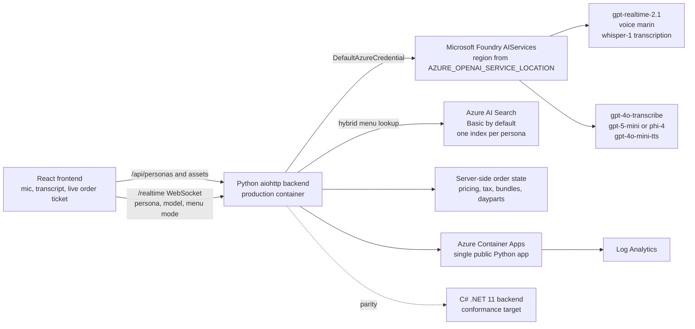

# Azure AI Drive-Thru

Microsoft Foundry AI Drive Thru is a multi-persona voice ordering demo for drive-thru and counter-service scenarios. One React frontend and the production Python backend serve the current `sonic`, `dunkin`, and `mcdonalds` personas, each with its own menu, prompt, theme, search index, pricing rules, dayparts, bundle rules, and demo script. The app supports a low-latency realtime voice pipeline and a cascade speech-to-text, reasoning, text-to-speech pipeline on Microsoft Foundry.

> This is a non-commercial demo application created for educational and illustrative purposes only. It is not affiliated with, endorsed by, or sponsored by the referenced brands or trademark owners. Brand references, colors, menu terms, and themes are used solely to demonstrate persona-specific voice ordering patterns and do not represent an official product.

## See it in action

**Microsoft Foundry AI Drive Thru** brings real-time voice ordering to quick serve restaurants. Every brand persona orders from its own Azure AI Search menu, server-side rules handle combos, up-sells, add-ons, and happy-hour pricing, and the voice model comes from the Microsoft Foundry model catalog.

https://github.com/user-attachments/assets/d4dc2713-5117-45cd-ba49-9aa2d707432d

*About 5 minutes, recorded from the running app using its built-in Demo Mode.*

## Screenshots

| Persona | Desktop view |
| --- | --- |
| Sonic Drive-In |  |
| Dunkin' |  |
| McDonald's |  |


The architecture image above came from the standalone McDonald's demo. It is useful for the agentic ordering flow, but the current unified app uses the architecture shown below.

## Current architecture



## Features

- Personas under `personas/`: currently `sonic`, `dunkin`, and `mcdonalds`. Each persona owns `persona.json`, `menu/menuItems.json`, prompt YAML, hints, assets, theme data, and optional demo assets.
- Persona picker with `?persona=<id>` deep links and a confirm dialog before switching when an order or conversation is active.
- Settings panel with Demo Mode, breakfast or lunch menu mode for daypart personas, voice picker, model picker, dummy data, session-token display, and operator logging toggles.
- Demo Mode for personas that ship `assets/demo/guestScript.json`, including **Run demo: This brand**, **Full tour**, an Ava guest voice card, captions, and synthetic guest audio playback.
- Search-grounded ordering with four tools: `search`, `update_order`, `get_order`, and `reset_order`.
- Server-side pricing, 8 percent tax, order validation, live ticket updates, transcript, and off-menu rejection.
- Combo and meal handling, including Sonic component upcharges when a combo drink is upsized above the included Medium, and McDonald's whole-meal size changes.
- Daypart menu mode for Sonic and McDonald's. Dunkin' is all day.
- Happy-hour rules from persona data: Sonic standalone slushes and fountain drinks from 2 to 4 PM Central, Dunkin' standalone signature lattes and cold beverages from 2 to 5 PM Eastern, and no McDonald's happy hour. Assistant prompts are told to claim a discount only when the tool result names discounted lines.
- Dunkin' regular coffee handling, where regular means cream and sugar, plus MUNCHKINS flavor and count choices with spoken pronunciation guidance.
- Echo suppression, barge-in, turn taking, silent-guest nudges, session resume, and rate-limit recovery.
- Keyless Azure access with `DefaultAzureCredential`, managed identity, and local auth disabled on provisioned Azure AI Search and AIServices resources.

## How it works

### Realtime pipeline

The browser streams microphone PCM over one `/realtime` WebSocket. The Python backend relays audio to the configured Foundry realtime deployment, with default catalog id `gpt-realtime-2.1`, voice `marin`, server VAD threshold `0.5`, 300 ms prefix padding, 200 ms silence duration, the active persona prompt, and persona-specific tool schemas. Guest speech transcription defaults to `whisper-1`. The model can call ordering tools, and the backend returns tool results to both the model and the frontend ticket.

`gpt-realtime-mini` is present in `app/backend/config.yaml`, but `infra/model-deployments.json` does not deploy it today, so it is not selectable in a standard azd deployment.

### Cascade pipeline

The cascade pipeline uses the same WebSocket and frontend contract. The backend segments guest audio locally, transcribes it with `gpt-4o-transcribe`, sends text and the same tool schemas to a Foundry chat model, then returns audio from `gpt-4o-mini-tts`. The catalog contains `gpt-5-mini` and `phi-4` for reasoning. The standard deployment creates both, while current persona allow-lists select `gpt-5-mini`.

## Azure services

`azd` provisions or connects these resources:

- Microsoft Foundry `AIServices` account, kind `AIServices`, SKU `S0`, with deployments from `infra/model-deployments.json`: `gpt-realtime-2.1`, `text-embedding-3-large`, `gpt-5-mini`, `phi-4`, `gpt-4o-transcribe`, and `gpt-4o-mini-tts`.
- Azure AI Search, Basic tier by default, with one index per persona from each `persona.json` `search.indexName`.
- Azure Container Apps hosting one container app that serves the built frontend and Python backend.
- Azure Container Registry, Log Analytics, Storage, and a user-assigned managed identity.
- Microsoft Entra ID in-app auth. EasyAuth is off. The SPA uses MSAL and the API validates JWTs with the `DriveThru.User` app role.

## Quick start

### Prerequisites

- Windows PowerShell 7 or a compatible shell.
- Azure Developer CLI (`azd`), Azure CLI, Docker, Node.js 20+, Python 3.11+, and Git.
- .NET 11 SDK only if you run the C# backend or conformance suites.
- Azure and GitHub authentication for deployment workflows.

### Deploy with azd

The deployed app always runs with Entra ID auth, so create the Entra app registration and pin its ids before the first `azd up`. Without them, the frontend build and backend startup both fail.

```powershell
azd auth login
azd env new <env-name>
azd env set AZURE_LOCATION eastus2
azd env set AZURE_OPENAI_SERVICE_LOCATION eastus2

# Create (or reconcile) the Entra app registration, then pin its ids
./scripts/Setup-EntraAuth.ps1 -TenantId <tenant-id> -Apply
azd env set ENTRA_TENANT_ID "<tenant-id>"
azd env set ENTRA_CLIENT_ID "<client-id>"

azd up
```

The `postprovision` hooks configure auth env files and build persona search indexes with `scripts/setup_search_index.ps1` or `.sh`. The `postdeploy` hook runs `scripts/smoke_realtime.ps1` or `.sh` as a non-fatal realtime smoke check.

Once the app has a public URL, re-run `./scripts/Setup-EntraAuth.ps1 -TenantId <tenant-id> -ClientId <client-id> -FromAzdEnv -Apply` to add its redirect URI (see [DEPLOY.md](DEPLOY.md#setup), case (c)), then verify with:

```powershell
./scripts/Verify-ProductionAuth.ps1
./scripts/Verify-ProductionAuth.ps1 -Authenticated
```

See [DEPLOY.md](DEPLOY.md) and [docs/customizing_deploy.md](docs/customizing_deploy.md) for deployment options.

## Repository layout

```text
app/backend/          Python aiohttp backend used in production
app/backend-dotnet/   C# .NET 11 parity backend
app/frontend/         React and TypeScript frontend
personas/             Persona data, menus, prompts, assets, and themes
infra/                Bicep modules and model deployment data
scripts/              azd hooks, search indexing, auth setup, smoke checks
tests/conformance/    Black-box conformance suite for backend parity
docs/                 Architecture, ADRs, operations docs, and demo script
```

## Testing

Use the smallest check that covers your change. Common checks are:

```powershell
# Python backend targeted tests
python -m pytest app/backend/tests/test_rebrand_verification.py app/backend/tests/test_tools_attach.py

# .NET backend unit tests, requires .NET 11 SDK
dotnet test app/backend-dotnet/Backend.slnx

# Cross-backend conformance harness, requires .NET 11 SDK
dotnet test tests/conformance/Conformance.slnx

# Frontend build and tests
cd app/frontend
npm test
$env:VITE_AUTH_MODE='Development'
npm run build
```

The CI rebrand ratchet scans tracked source and Markdown files for brand-word drift. Cross-brand documentation is intentionally allowed only in documented files that compare personas by design.

## More docs

- [Demo script](docs/DEMO_SCRIPT.md)
- [Persona architecture](docs/persona-architecture.md)
- [Order resume](docs/order_resume.md)
- [Rate-limit recovery](docs/rate_limit_recovery.md)
- [ADR-001: persona architecture](docs/adr/ADR-001-persona-architecture.md)
- [ADR-002: Entra authentication](docs/adr/ADR-002-entra-authentication.md)
